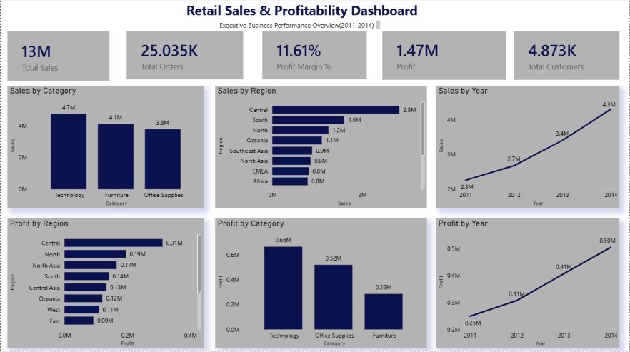
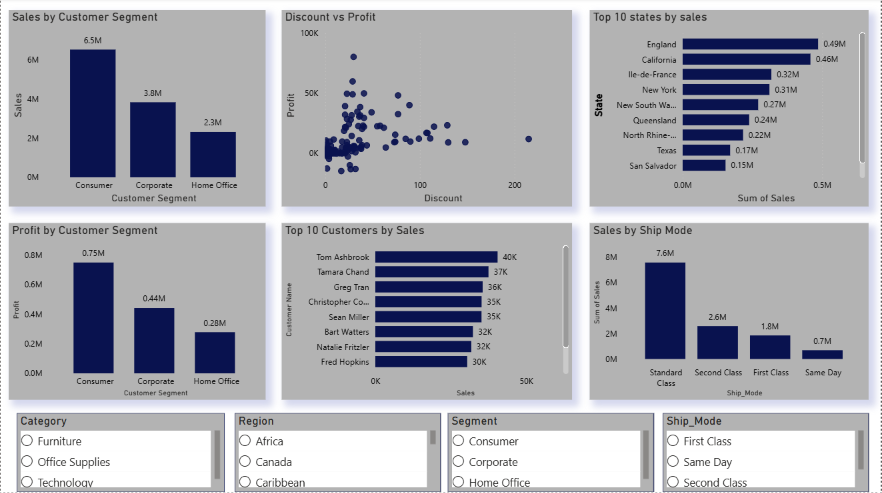

#  Retail Profit Optimization Dashboard

## Project Overview

This project presents an end-to-end retail business analytics solution developed using **Python** and **Power BI**. The objective is to analyze sales performance, profitability, customer behavior, regional trends, and operational metrics to provide actionable business recommendations.

The project demonstrates the complete analytics workflow—from data cleaning and exploratory analysis in Python to interactive dashboard development in Power BI—making it suitable for business decision-makers and recruiters evaluating analytical and visualization skills.

---

# Business Problem

Retail organizations generate large volumes of transactional data but often struggle to transform it into meaningful business insights.

This project addresses questions such as:

- Which product categories generate the highest sales and profit?
- Which regions contribute the most to revenue?
- Which customer segments are most valuable?
- How do discounts affect profitability?
- Who are the highest-value customers?
- Which shipping modes generate maximum sales?

---

#  Dataset

**Dataset:** Global Superstore Sales Dataset

The dataset includes:

- Orders
- Customers
- Products
- Categories
- Sales
- Profit
- Discounts
- Shipping Modes
- Geographic Regions

---

#  Tools & Technologies

| Tool | Purpose |
|------|----------|
| Python | Data Cleaning & Analysis |
| Pandas | Data Manipulation |
| NumPy | Numerical Analysis |
| Matplotlib | Data Visualization |
| Microsoft Excel | Data Validation |
| Power BI | Interactive Dashboard |
| GitHub | Project Documentation |

---

#  Python Analysis

Python was used for data preprocessing and exploratory data analysis.

## Tasks Performed

- Imported dataset
- Checked missing values
- Removed duplicate records
- Corrected data types
- Performed descriptive statistics
- Calculated KPIs
- Explored category-wise sales
- Region-wise analysis
- Customer analysis
- Profit analysis
- Discount analysis

### Libraries Used

```python
import pandas as pd
import numpy as np
import matplotlib.pyplot as plt
```

---

#  Power BI Dashboard

The Power BI report consists of two interactive pages.

---

#  Page 1 – Executive Dashboard

The Executive Dashboard provides a high-level overview of business performance.

### KPIs

- Total Sales
- Total Orders
- Profit Margin
- Total Profit
- Total Customers

### Visualizations

- Sales by Category
- Profit by Category
- Sales by Region
- Profit by Region
- Sales Trend (2011–2014)
- Profit Trend (2011–2014)

This page enables executives to quickly understand business performance across categories, regions, and time.
## Dashboard Preview

### Executive Dashboard



---


---

#  Page 2 – Business Insights Dashboard

This page focuses on operational and customer insights.

### Visualizations

- Sales by Customer Segment
- Profit by Customer Segment
- Discount vs Profit
- Top 10 Customers by Sales
- Top 10 States by Sales
- Sales by Ship Mode

### Interactive Filters

- Category
- Region
- Customer Segment
- Ship Mode

These slicers allow users to dynamically filter the dashboard.
## Dashboard Preview


### Business Insights Dashboard



---

#  Key Performance Indicators (KPIs)

- Total Sales
- Total Profit
- Profit Margin
- Total Orders
- Total Customers

---

# Key Business Insights

### 1. Technology generated the highest revenue and profit.

Technology products consistently outperformed Furniture and Office Supplies.

---

### 2. Consumer customers generated the highest sales.

The Consumer segment contributed the largest share of revenue, making it the most valuable customer segment.

---

### 3. Central region performed exceptionally well.

The Central region generated the highest sales and profitability compared to other regions.

---

### 4. Higher discounts reduced profitability.

Scatter plot analysis indicated that orders with larger discounts frequently produced lower profits.

---

### 5. Revenue is concentrated among a small number of customers.

The Top 10 customers contributed a significant portion of total sales, highlighting opportunities for customer retention.

---

### 6. Standard Class shipping handled the majority of sales.

Standard Class was the most frequently used shipping mode, indicating customer preference for economical delivery.

---

### 7. Sales and profits increased consistently over time.

Annual trend analysis showed steady business growth from 2011 to 2014.

---

#  Business Recommendations

Based on the analysis, the following recommendations are proposed:

- Increase investment in high-performing product categories such as Technology.
- Optimize discount strategies to improve profit margins.
- Develop loyalty programs for high-value customers.
- Strengthen marketing efforts in high-performing regions.
- Improve inventory allocation based on regional demand.
- Optimize shipping operations while maintaining customer satisfaction.
- Monitor discount policies to prevent unnecessary profit erosion.

---

#  Skills Demonstrated

## Business Analytics

- KPI Development
- Retail Analytics
- Customer Segmentation
- Profitability Analysis
- Sales Analysis
- Business Intelligence

## Python

- Data Cleaning
- Exploratory Data Analysis
- Data Transformation
- Statistical Summary
- Visualization

## Power BI

- Interactive Dashboards
- KPI Cards
- Bar Charts
- Scatter Charts
- Trend Analysis
- Slicers
- Dashboard Design
- Business Storytelling

## Soft Skills

- Problem Solving
- Data-Driven Decision Making
- Strategic Thinking
- Business Communication
- Analytical Reasoning

---

#  Learning Outcomes

This project strengthened my ability to:

- Clean and preprocess business data using Python.
- Perform exploratory data analysis (EDA).
- Build executive-level dashboards in Power BI.
- Design business KPIs.
- Translate data into actionable business insights.
- Present analytical findings to support strategic decision-making.

---

#  Future Improvements

Potential enhancements include:

- Sales forecasting using Machine Learning.
- Customer Lifetime Value (CLV) analysis.
- Customer churn prediction.
- Inventory optimization.
- Interactive drill-through reports.
- Predictive profitability analysis.

---

# Author

**Sushmitha Gowda Y**

MBA – Business Analytics & Business Consulting

Passionate about leveraging analytics and visualization to solve business problems and support strategic decision-making.

---

